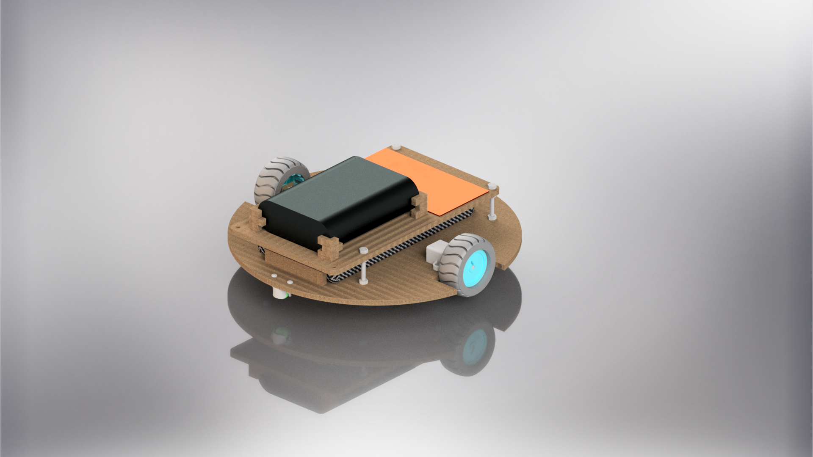

# Differential Drive Robot
Differential Drive Robot development for Universidad EIA in Envigado, Antioquia.  Contains all files, including CAD, firmware programming, ROS2 software programming. 

Look at it working in [YouTube](https://youtu.be/ukqRsuS6mHY)

## Authors
- Antonio Cock
- Daniel Correa
- Fernando Velilla
- Raúl Villamil
- Tomás Vélez

